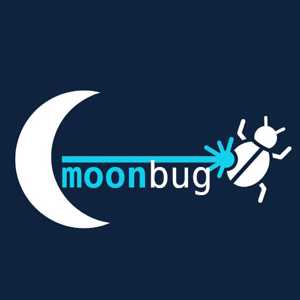

# vscode-moonbug

Lua debugger for Visual Studio Code, powered by [moonbug](https://github.com/atomicptr/moonbug)

Please report issues at the main repository: [atomicptr/moonbug](https://github.com/atomicptr/moonbug)

## Install

TODO

## License

MIT
